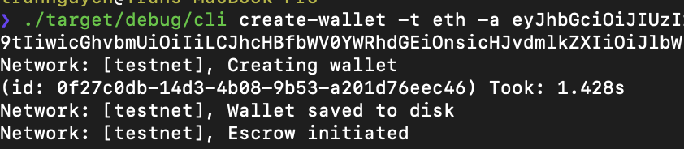

# New York City TSS client

## Introduction

New York City TSS is the client implementation for ezsy's TSS wallet.

We build it as a `.so` or   `.a` file which will be used by our ezsy flutter mobile app via dartlang ffi as a flutter plugin.

## Requirement

New York City TSS server is required to interact with the client. It will be hosted in a separate repository.

## Installation

```bash
git clone https://github.com/ezsyfi/NewYorkCity-TSS-client

cargo build --release
```


## Using the CLI
```bash
./target/release/cli --help            
```

```text
Command Line Interface for a minimalist decentralized crypto-currency wallet

USAGE:
    cli [FLAGS] [SUBCOMMAND]

FLAGS:
    -h, --help       Prints help information
    -V, --version    Prints version information
    -v               Sets the level of verbosity

SUBCOMMANDS:
    create-wallet    Create an MPC wallet
    help             Prints this message or the help of the given subcommand(s)
    wallet           Operation on wallet
```

## Wallet creation (required)
- Use email `tcdnguyen1997+dev@gmail.com`, password: `123456` to login and get auth token from API: https://go.api-staging.ezsy.com/api/v1/auth/signin
```bash
./target/release/cli create-wallet -t <coin type> -a <token>
``` 

* Output: 



## Wallet operations
```bash
./target/release/cli wallet --help
```

```text
Operation on wallet

USAGE:
    cli wallet [FLAGS] [SUBCOMMAND]

FLAGS:
    -s               Private share backup
    -b               Total balance
    -h, --help       Prints help information
    -u               List unspent transactions (tx hash)
    -a               Generate a new address
    -r               Private share recovery
    -o               Private shares rotation
    -V, --version    Prints version information
    -c               Backup verification

SUBCOMMANDS:
    help    Prints this message or the help of the given subcommand(s)
    send    Send a transaction
```
### Get a derived/new address (HD)
```bash
./target/release/cli wallet -a
```

* Output: 
```text
ETH address: 0x5804f9a130af0fae523183630eae5202a7f7e14c
```

### Get total balance
```bash
./target/release/cli wallet -b
```

* Output: 
```text
ETH Balance: [0]
```

## BTC:
### Get list unspent
```bash
./target/release/cli wallet -u
```

* Output: 
```text
Network: [testnet], Unspent tx hashes: [
bc32ff53c1b9f71d7a6a5e3f5ec7bc8d20afe50214110a0718c9004be33d57d6
53bc8eca351446f0ec2c13a978243b726a132792305a6758bfc75c67209f9d6b
]
```

### Send a transaction
```bash
./target/release/cli wallet send -t [ADDRESS] -a [BTC_AMOUNT]
```

* Example: 
```bash
./target/release/cli wallet send -t tb1quxl4c4cyl3586s7tuql7tqqsv233sumxz0588a -a 0.0001
```

* Output: 
```text
Network: [testnet], Sent 0.0001 BTC to address tb1quxl4c4cyl3586s7tuql7tqqsv233sumxz0588a. Transaction ID: 44545bf81fc8aebcde855c2e33a5f83a17a93f76164330e1ee9e366e8e039444
```

* Explorer:
https://www.blocktrail.com/tBTC/tx/44545bf81fc8aebcde855c2e33a5f83a17a93f76164330e1ee9e366e8e039444

### Rotate secret shares
```bash
./target/release/cli wallet -o
```

* Output: 
```text
Rotating secret shares
key rotation complete, (Took: PT1.087591809S)
```

### Backup
Backup has 3 phases: (1) creating the backup, encrypted on a seperate file, (2) verifying the backup (3) recover

#### create backup
```bash
./target/release/cli wallet -s
```

* Output: 
```text
Backup private share pending (it can take some time)...
Backup key saved in escrow (Took: PT20.828933102S)
```

#### verify backup
```bash
./target/release/cli wallet -c
```

* Output: 
```text
verify encrypted backup (it can take some time)...
backup verified 🍻
 (Took: PT12.325232629S)
```

#### Recover from backup
```bash
./target/release/cli wallet -r
```

* Output: 
```text
backup recovery in process 📲 (it can take some time)...
Recovery Completed Successfully ❤️
 Backup recovered 💾(Took: PT0.405034789S)
```

